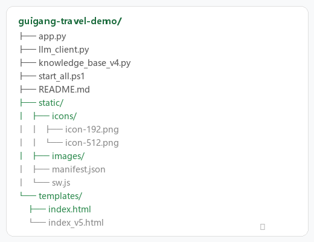

# 🏕️ 贵港旅游智能助手 v6

> 基于 Flask + LLM 的贵港市旅游智能问答应用，支持景点推荐、行程规划、美食查询、天气服务等。



## ✨ 功能特性

- 🤖 **智能问答** — 基于 LLM 的多轮对话，支持旅游相关问题
- 📍 **30+ 景点** — 覆盖港北/港南/覃塘/桂平/平南 5 个区域
- 🎯 **分类浏览** — 自然景观、人文历史、公园休闲、主题乐园、科普教育、农业观光
- 🗺️ **地图导航** — 景点位置与导航
- 🌤️ **天气服务** — 实时天气查询
- 💬 **语音交互** — 语音输入/输出
- 🔐 **用户系统** — 注册/登录/个人中心，收藏/打卡/偏好云端同步
- 📱 **PWA 支持** — 可添加到手机桌面，离线可用
- 🎨 **现代化 UI** — 移动端优先设计，类 App 体验

## 🏗️ 项目结构

```
guigang-travel-demo/
├── app.py                  # Flask 主应用（路由 + API）
├── auth.py                 # 用户认证模块（SQLite）
├── llm_client.py           # LLM 客户端封装
├── knowledge_base_v4.py    # 旅游知识库（景点数据）
├── start_all.ps1           # 一键启动脚本
├── requirements.txt        # Python 依赖
├── data/
│   ├── users.db            # 用户数据库（自动生成）
│   └── spot_images.json    # 景点图片数据
├── README.md               # 项目说明
├── static/
│   ├── css/
│   │   └── auth.css        # 登录/注册 UI 样式
│   ├── js/
│   │   ├── auth.js         # 登录/注册 逻辑 + 数据同步
│   │   ├── favorites.js    # 收藏功能（双写：LocalStorage + API）
│   │   ├── recent.js       # 最近浏览（双写）
│   │   ├── checkin.js      # 打卡签到（双写）
│   │   └── preferences.js  # 用户偏好（双写）
│   ├── icons/              # PWA 图标 (192px / 512px)
│   ├── images/             # 静态图片资源
│   ├── manifest.json       # PWA 配置
│   └── sw.js               # Service Worker
└── templates/
    ├── index.html          # v6 主页面（全新UI）
    └── index_v5.html       # 备份版本
```

## 🚀 快速开始

### 环境要求

- Python 3.8+
- Flask

### 安装运行

```bash
# 克隆仓库
git clone https://github.com/llilongmao-sudo/guigang-travel-demo.git
cd guigang-travel-demo

# 安装依赖
pip install flask requests flask-login flask-cors

# 启动服务
python app.py
```

访问 **http://localhost:5001**

### 一键启动（Windows）

```powershell
.\start_all.ps1
```

## 📱 访问方式

| 方式 | 地址 |
|------|------|
| 本地访问 | http://localhost:5001 |
| 局域网 | http://192.168.110.232:5001 |

> 公网访问需配合 ngrok / cpolar / localtunnel 等隧道工具

## 🛠️ 技术栈

- **后端**: Python 3.12 + Flask
- **认证**: Flask-Login + SQLite
- **前端**: 原生 HTML5 / CSS3 / JavaScript (ES6+)
- **AI**: LLM API 对接
- **部署**: 支持本地 / 局域网 / 公网隧道
- **PWA**: Service Worker + Web App Manifest

## 📸 界面预览

### 首页 v6
- Hero 横幅（时段问候语 + 搜索提示）
- 分类快捷入口（6 大类别）
- 推荐景点横滑卡片
- 快捷操作栏（一日游 / 美食 / 景点 / 天气）

### 聊天界面
- 多轮对话记忆
- 侧边栏景点列表
- 语音输入/输出
- 历史记录管理

## 📝 更新日志

### v7 (2026-06-29) — 用户登录系统
- ✅ **用户注册/登录** — 邮箱注册，Session 认证
- ✅ **个人中心** — 昵称修改、用户菜单下拉
- ✅ **数据云端同步** — 收藏/打卡/偏好双写（LocalStorage + 服务端 API）
- ✅ **首次登录合并** — 自动将本地数据同步到云端
- ✅ **离线降级** — 未登录/网络异常时自动回退 LocalStorage
- ✅ SQLite 用户数据库（auth.py）
- ✅ Flask-Login 会话管理

### v6 (2026-06-12)
- ✅ 全新首页 UI 重构
- ✅ Hero 横幅 + 分类入口 + 推荐景点横滑
- ✅ 快捷操作栏替代冗长的区域/网格模块
- ✅ 返回首页功能
- ✅ 侧边栏景点列表修复

### v5 (2026-06-05)
- ✅ 初始版本发布
- ✅ 30 个景点数据
- ✅ PWA 支持
- ✅ 公网隧道集成

## 📄 License

MIT License

---

**作者**: llilongmao-sudo  
**城市**: 广西·贵港 🌿
